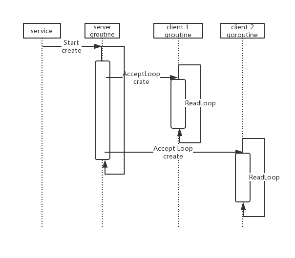

# NATS 开源学习——0X02：Server构造

> NATS源码学习系列文章基于[gnatsd1.0.0](https://github.com/nats-io/gnatsd/tree/v1.0.0)。该版本于2017年7月13
> 日发布（[Release v1.0.0](https://github.com/nats-io/gnatsd/releases/tag/v1.0.0)）,在此之前v0.9.6是2016年12月
> 16日发布的,中间隔了半年。算是一个比较完备的版本，但是这个版本还没有增加集群支持。为什么选择这个版本呢？
> 因为一来这个版本比较稳定，同时也包含了集群管理和[Stream](https://github.com/nats-io/nats-streaming-server)
> 落地相关的逻辑，相对完善。

## 目录结构
抛开第一级目录的其他文件，现在开始聚焦到server这个目录来：

	server cz$ find . -name "*\.go" |grep -v test | xargs wc -l | sort -d -k 1
	      12 ./pse/pse_solaris.go
	      13 ./pse/pse_rumprun.go
	      16 ./service.go
	      23 ./pse/pse_darwin.go
	      36 ./errors.go
	      50 ./monitor_sort_opts.go
	      55 ./ciphersuites_1.5.go
	      56 ./util.go
	      64 ./ciphersuites_1.8.go
	      72 ./pse/pse_freebsd.go
	      90 ./signal_windows.go
	      93 ./const.go
	      94 ./service_windows.go
	     115 ./pse/pse_linux.go
	     139 ./signal.go
	     163 ./log.go
	     190 ./auth.go
	     268 ./pse/pse_windows.go
	     527 ./monitor.go
	     640 ./sublist.go
	     648 ./reload.go
	     738 ./parser.go
	     762 ./route.go
	     895 ./opts.go
	    1047 ./server.go
	    1410 ./client.go
	    8216 total
	    
抛开test文件，总共只有26个文件，8K代码。所以gnatsd核心还是比较简单的，休闲之余就可以将其代码通读一遍，跟着我们的文章走也很快。

## 创建Server对象
在server.go里面有:

	 100 // New will setup a new server struct after parsing the options.
	 101 func New(opts *Options) *Server {
	...
	
	 123     s := &Server{
	 124         configFile: opts.ConfigFile,
	 125         info:       info,
	 126         sl:         NewSublist(),
	 127         opts:       opts,
	 128         done:       make(chan bool, 1),
	 129         start:      now,
	 130         configTime: now,
	 131     }	
	...	 
	 157     return s    
	 }

创建Server的时候，用选项opts和配置文件opts.ConfigFile初始化一个Server对象，Server为：

	  47 // Server is our main struct.
	  48 type Server struct {
	  49     gcid uint64
	  50     grid uint64
	  51     stats
	  52     mu            sync.Mutex
	  53     info          Info
	  54     infoJSON      []byte
	  55     sl            *Sublist
	  56     configFile    string
	  57     optsMu        sync.RWMutex
	  58     opts          *Options
	  59     running       bool
	  60     shutdown      bool
	  61     listener      net.Listener
	  62     clients       map[uint64]*client
	  63     routes        map[uint64]*client
	  64     remotes       map[string]*client
	  65     users         map[string]*User
	  66     totalClients  uint64
	  67     done          chan bool
	  68     start         time.Time
	  69     http          net.Listener
	  70     httpHandler   http.Handler
	  71     profiler      net.Listener
	  72     httpReqStats  map[string]uint64
	  73     routeListener net.Listener
	  74     routeInfo     Info
	  75     routeInfoJSON []byte
	  76     rcQuit        chan bool
	  77     grMu          sync.Mutex
	  78     grTmpClients  map[uint64]*client
	  79     grRunning     bool
	  80     grWG          sync.WaitGroup // to wait on various go routines
	  81     cproto        int64          // number of clients supporting async INFO
	  82     configTime    time.Time      // last time config was loaded
	  83     logging       struct {
	  84         sync.RWMutex
	  85         logger Logger
	  86         trace  int32
	  87         debug  int32
	  88     }
	  89 }  
	  
这里感性认识一下就好了，后面说到具体逻辑的时候回用到响应的成员。

##	 运行Server
在main函数中，我们看到是通过：`server.Run(s)` 来启动Server的，他实际上在 services.go中：

	  6 // Run starts the NATS server. This wrapper function allows Windows to add a
	  7 // hook for running NATS as a service.
	  8 func Run(server *Server) error {
	  9     server.Start()
	 10     return nil
	 11 }
	 
可以看到实际上是调用了server.Start函数，这里通过编译选项控制了下平台：

	 1 // +build !windows	 
因为在windows上需要对windows service做兼容，所以有个单独的文件”service_windows.go” 来实现相关逻辑，该跨平台操作主要通过
“golang.org/x/sys/windows/svc"来实现对"Windows service"的支持:

	 36 func (w *winServiceWrapper) Execute(args []string, changes <-chan svc.ChangeRequest,
	 37     status chan<- svc.Status) (bool, uint32) {
	 38
	 39     status <- svc.Status{State: svc.StartPending}
	 40     go w.server.Start()
	 
不管哪个平台，其实最终都是Server对象的Start函数。

## Server.Start()

先来看代码：

	 237 func (s *Server) Start() {
	 241     // Avoid RACE between Start() and Shutdown()
	 242     s.mu.Lock()
	 243     s.running = true
	 244     s.mu.Unlock()
	 245
	 246     s.grMu.Lock()
	 247     s.grRunning = true
	 248     s.grMu.Unlock()
	....
	 259
	 260     // Start monitoring if needed
	 261     if err := s.StartMonitoring(); err != nil {
	...
	 265
	 266     // The Routing routine needs to wait for the client listen
	 267     // port to be opened and potential ephemeral port selected.
	 268     clientListenReady := make(chan struct{})
	 270     // Start up routing as well if needed.
	 271     if opts.Cluster.Port != 0 {
	 272         s.startGoRoutine(func() {
	 273             s.StartRouting(clientListenReady)
	 274         })
	 275     }
	 276
	 277     // Pprof http endpoint for the profiler.
	 278     if opts.ProfPort != 0 {
	 279         s.StartProfiler()
	 280     }
	 281
	 282     // Wait for clients.
	 283     s.AcceptLoop(clientListenReady)
	 284 } 
	 
最开始的地方通过mutex控制，设置服务状态的标记位。

然后启动Monitor监控以及接受其他服务消息的Router服务，需要的话启动Profile。

这里看最后一步`s.AcceptLoop `	,这里想象普通的网络程序，这里开启了一个Loop来接受客户端的TCP链接。

## AcceptLoop

来看代码：

	 370 // AcceptLoop is exported for easier testing.
	 371 func (s *Server) AcceptLoop(clr chan struct{}) {
	 ...
	 
	 430     for s.isRunning() {
	 431         conn, err := l.Accept()
	 432         if err != nil {
	 433             if ne, ok := err.(net.Error); ok && ne.Temporary() {
	 434                 s.Debugf("Temporary Client Accept Error(%v), sleeping %dms",
	 435                     ne, tmpDelay/time.Millisecond)
	 436                 time.Sleep(tmpDelay)
	 437                 tmpDelay *= 2
	 438                 if tmpDelay > ACCEPT_MAX_SLEEP {
	 439                     tmpDelay = ACCEPT_MAX_SLEEP
	 440                 }
	 441             } else if s.isRunning() {
	 442                 s.Noticef("Accept error: %v", err)
	 443             }
	 444             continue
	 445         }
	 446         tmpDelay = ACCEPT_MIN_SLEEP
	 447         s.startGoRoutine(func() {
	 448             s.createClient(conn)
	 449             s.grWG.Done()
	 450         })
	 451     }
	 452     s.Noticef("Server Exiting..")
	 453     s.done <- true
	 454 } 
	 
这里传入的clr，最终当循环退出时，会传递一个消息到channel中，通知启动Server.Start()的调用者，服务结束了。

而这里的：`for s.isRunning() {` 形成了真正的AcceptLoop等待客户端过来创建TCP链接。

每当Accept一条心链接后，开启一个goroutine用这个链接创建一个Client对象。

## ReadLoop

创建client的代码是这样的：

	 642 func (s *Server) createClient(conn net.Conn) *client {
	...
	
	 646     c := &client{srv: s, nc: conn, opts: defaultOpts, mpay: int64(opts.MaxPayload), start: time.Now()}
	...
	
	 658
	 659     // Initialize
	 660     c.initClient()

	 664     // Send our information.
	 665     c.sendInfo(info)
	...
	
	 743     // Spin up the read loop.
	 744     s.startGoRoutine(func() { c.readLoop() }) 

	...
	}
	
首先创建一个client对象并将链接conn传个client。然后对client进行初始化，并向客户端发送INFO(想想在[NATS 开源学习——0X00：协议]()
中介绍的协议)	。接着开启一个routinue执行client的readLoop。相关代码，等我们分析client的时候再展开，实际上就是从客户端读消息然后处理消息。

这块逻辑在1.4.x版本中有些不同，在新版本中还开启了一个writeLoop，用来flush缓存中的数据到客户端，这样做就可以对消息进行读写分离，并提高写的
效率。在1.0.0中还是读写在同一个goroutine里。

## goroutine管理

看到上面的代码中，启动一个goroutine都是通过`s.startGoRoutine `整个函数的：

	 987 func (s *Server) startGoRoutine(f func()) {
	 988     s.grMu.Lock()
	 989     if s.grRunning {
	 990         s.grWG.Add(1)
	 991         go f()
	 992     }
	 993     s.grMu.Unlock()
	 994 }

这里显示用一个锁来控制对s.grWG的修改，然后给waitgroup s.grWG做增1操作.
然后在调用时有：

	 447         s.startGoRoutine(func() {
	 448             s.createClient(conn)
	 449             s.grWG.Done()
	 450         })
也就是client链接断开是做waitgroup的Done操作。

在Server的ShutDown里面有	 

	 366     // Wait for go routines to be done.
	 367     s.grWG.Wait()
	 
等待所有链接断开并回收groutine。	 

## 时序
现在我们再回过头来看整个时序关系。

就大概了解了：

1. 服务Server先开一个AcceptLoop用来接收客户端TCP链接。
2. 接收到一个客户端的链接后，启动一个ReadLoop来接收客户端发送过来的消息。
3. 整个readloop负责收消息然后处理消息，直到退出。
4. 服务Server通过WaitGroup来管理所有的客户端链接状况。

## 总结

这一篇，从Server入手，看一个服务进程是怎么起来的，然后分几个goroutine，分别是做什么的，主控服务怎么对服务每个客户端的goroutine进行管理的。
可以说是了解了服务的整体结构吧。
 	 

	 
	 

