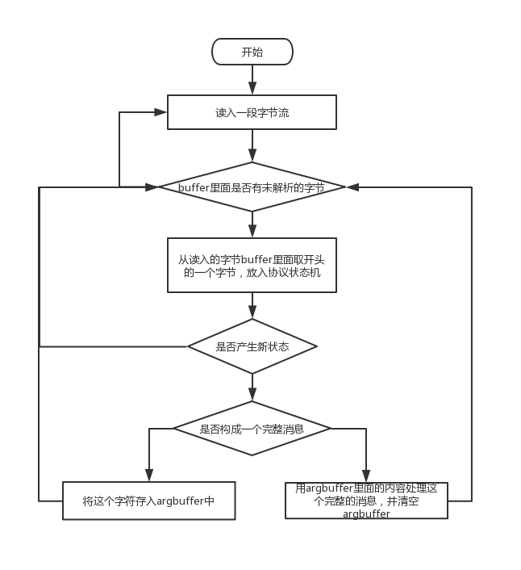

# NATS 开源学习——0X04：协议解析

> NATS源码学习系列文章基于[gnatsd1.0.0](https://github.com/nats-io/gnatsd/tree/v1.0.0)。该版本于2017年7月13
> 日发布（[Release v1.0.0](https://github.com/nats-io/gnatsd/releases/tag/v1.0.0)）,在此之前v0.9.6是2016年12月
> 16日发布的,中间隔了半年。算是一个比较完备的版本，但是这个版本还没有增加集群支持。为什么选择这个版本呢？
> 因为一来这个版本比较稳定，同时也包含了集群管理和[Stream](https://github.com/nats-io/nats-streaming-server)
> 落地相关的逻辑，相对完善。

Client对象在自己的goroutine里面读消息，解析消息，然后写消息。消息的读取和拼接在之前的文章[NATS 开源学习——0X03：Client服务]().有介绍：

而这里的协议状态机就放在"server/parse.go"文件中：

	 func (c *client) parse(buf []byte) error {
	 ...
	 }
	 
## 状态机

	 17 type parseState struct {
	 18     state   int
	 19     as      int
	 20     drop    int
	 21     pa      pubArg
	 22     argBuf  []byte
	 23     msgBuf  []byte
	 24     scratch [MAX_CONTROL_LINE_SIZE]byte
	 25 }	 
	 
整个协议，用这个作为状态机记录。其中state表示各个状态，其实这里有点类似游标的感觉，比如对于Info协议：

	INFO {["option_name":option_value],...}\r\n

当读入到字母"I"的时候，就会切入到状态"OP_I"状态。

之后读到”INFO”后面的空格时，进入到"INFO_ARG"状态，至此，后面的内容都会被当成参数，记录到argBuf参数中，直到最后"\r\n"的时候结束对这个完整消息的读取。

## 协议解析

服务器在客户端连接过来的时候，服务器会向客户端发送"INFO"协议，客户端同时会发送"CONNECT"，这里我们来看下协议是如何解析的。

parse.go定义了n多状态：

	 27 // Parser constants
	 28 const (
	 29     OP_START = iota
	 ...
	 }

因为状态机默认是"OP_START"状态， 当读入到第一条"CONNECT" ：

	101         switch c.state {
	102         case OP_START:
	103             if b != 'C' && b != 'c' && authSet {
	104                 goto authErr
	105             }
	106             switch b {
	

是在"OP_START"状态下，先判断第一个字母是不是"C"/"c"，也就是大小写都兼容，并且客户端连接过来的第一条消息必须是"CONNECT"。

接着往下，在这个状态下，如果遇到"C"，就：

	119             case 'C', 'c':
	120                 c.state = OP_C

此时切换到 "OP_C"状态。

接着检查下一个字符：

	389         case OP_C:
	390             switch b {
	391             case 'O', 'o':
	392                 c.state = OP_CO

要求必须是"O"，并切换到OP_CO状态。

如此往复，直到组合出 "CONNECT"，也就是按顺序读入一个这样的单词。

之后切换到"OP_CONNECT"状态：

	431         case OP_CONNECT:
	432             switch b {
	433             case ' ', '\t':
	434                 continue
	435             default:
	436                 c.state = CONNECT_ARG
	 
之后过滤一下空格:' '	 或者'\t'。然后切换到"CONNECT_ARG"状态。此时开始处理后面的真实参数：

	439         case CONNECT_ARG:
	440             switch b {
	441             case '\r':
	442                 c.drop = 1
	443             case '\n':
	444                 var arg []byte
	445                 if c.argBuf != nil {
	446                     arg = c.argBuf
	447                     c.argBuf = nil
	448                 } else {
	449                     arg = buf[c.as : i-c.drop]
	450                 }
	451                 if err := c.processConnect(arg); err != nil {
	452                     return err
	453                 }
	454                 c.drop, c.state = 0, OP_START
	455                 // Reset notion on authSet
	456                 authSet = c.isAuthTimerSet()

这里就是依次往后读，直到出现了换行标记"\r\n"。此时将前面"OP_CONNECT"状态的空格之后到"CONNECT_ARG"状态的换行之前的部分暂存到"argBuf"中，
并在读取完成后给到"c.processConnect"进行处理。

其他协议也是类似的处理流程，先解析出命令字单词，然后解析参数部分并交由响应的函数进行处理。

## 连接协议
连接协议主要是指客户端连接到服务器后，向服务器发送"CONNECT"协议。而服务器在Accept一个客户端后，向客户端发送“INFO”协议。
先来看如何处理Connect:

	421 func (c *client) processConnect(arg []byte) error {
	422     c.traceInOp("CONNECT", arg)
	...
	
	 446     if err := json.Unmarshal(arg, &c.opts); err != nil {
	 447         c.mu.Unlock()
	 448         return err
	 449     }
	 450     // Indicate that the CONNECT protocol has been received, and that the
	 451     // server now knows which protocol this client supports.
	 452     c.flags.set(connectReceived)
	 453     // Capture these under lock
	 454     proto := c.opts.Protocol
	 455     verbose := c.opts.Verbose
	 
	 ...
	 497     if verbose {
	 498         c.sendOK()
	 499     }

这里会先记录收到了"CONNECT"的日志，然后对参数部分进行JSON解析（这里可以看到如文档所示，CONNECT的参数是JSON格式的），并存储在c.opts里面，也就是
Clinet记录了客户端的信息。

最后，如果客户端传入了[NATS 开源学习——0X00：协议]()中说的 "verbose: 是否关闭服务器的+OK冗余信息，+OK见下面的说明"，那么会向客户端回一个内容：

	+OK
的协议。

再来看Info的处理，这里会解析参数后调用"c.processRouteInfo":

	 399 // Process the information messages from Clients and other Routes.
	 400 func (c *client) processInfo(arg []byte) error {
	 401     info := Info{}
	 402     if err := json.Unmarshal(arg, &info); err != nil {
	 403         return err
	 404     }
	 405     if c.typ == ROUTER {
	 406         c.processRouteInfo(&info)
	 407     }
	 408     return nil
	 409 }
	 
具体processRouteInfo的操作，在后面的文章[NATS 开源学习——0X07：Router转发]()详细介绍。
	 
 
## 心跳协议
再来看对心跳的处理，当收到来自客户端的Ping后：

	 574 func (c *client) processPing() {
	 575     c.mu.Lock()
	 576     c.traceInOp("PING", nil)
	 577     if c.nc == nil {
	 578         c.mu.Unlock()
	 579         return
	 580     }
	 581     c.traceOutOp("PONG", nil)
	 582     err := c.sendProto([]byte("PONG\r\n"), true)
 
收到Ping后，首先日志记录下接受到了Ping，接着就发送内容为：

	PONG\r\n

的Pong消息给客户端。然后将服务器的信息更新给客户端：
	
	 604     if sendUpdateINFO {
	 605         srv.mu.Lock()
	 606         // Use the cached protocol
	 607         proto := srv.infoJSON
	 608         srv.mu.Unlock()
	 609
	 610         c.mu.Lock()
	 611         c.sendInfo(proto)
	 612         c.mu.Unlock()
	 613     }	
 
 而如果收到了Pong消息，则：
 
	 616 func (c *client) processPong() {
	 617     c.traceInOp("PONG", nil)
	 618     c.mu.Lock()
	 619     c.pout = 0
	 620     c.mu.Unlock()
	 621 }
	 
除了日志记录外，仅将c.pout设置为0，该变量用来记录服务器Ping出去多少个，还没有收到Pong。如果过多，就会断开连接。

## 总结
这里我们分析了gnatsd是如何通过状态机的变化从网络流里读取并解析一个完整的协议。并介绍了对连接协议INFO/CONNECT以及心跳协议PING/PONG的处理。
这里可能会奇怪，为何要处理INFO呢？这个不是服务器么？这是因为在Router的功能里面，gnatsd充当了其他gnatsd的客户端。