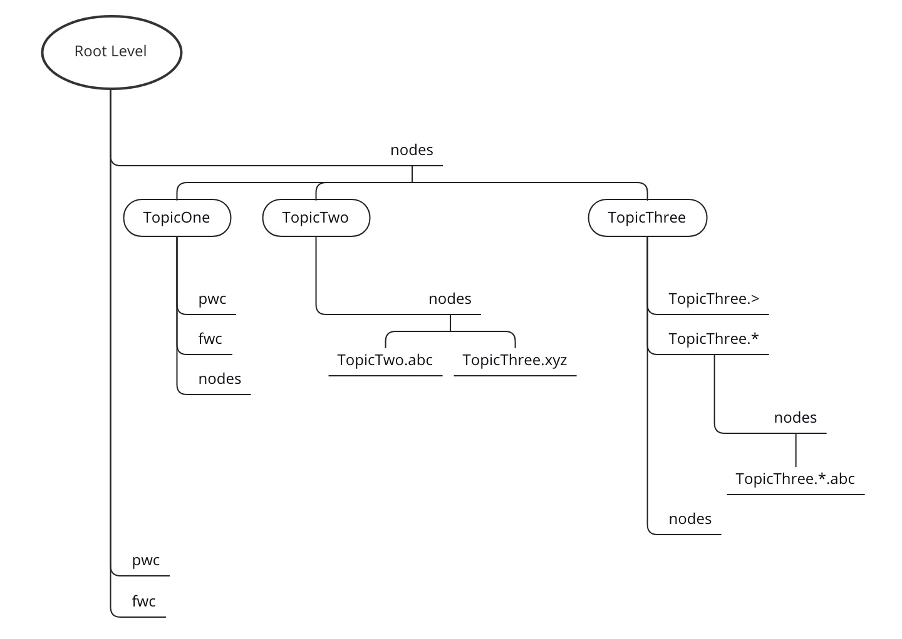

# NATS 开源学习——0X06：消息存储结构

> NATS源码学习系列文章基于[gnatsd1.0.0](https://github.com/nats-io/gnatsd/tree/v1.0.0)。该版本于2017年7月13
> 日发布（[Release v1.0.0](https://github.com/nats-io/gnatsd/releases/tag/v1.0.0)）,在此之前v0.9.6是2016年12月
> 16日发布的,中间隔了半年。算是一个比较完备的版本，但是这个版本还没有增加集群支持。为什么选择这个版本呢？
> 因为一来这个版本比较稳定，同时也包含了集群管理和[Stream](https://github.com/nats-io/nats-streaming-server)
> 落地相关的逻辑，相对完善。

在前面的[NATS 开源学习——0X05：订阅消息]()中讲到订阅消息会在类型为Sublist 的svr.sl中插入一个subscription， 而在取消订阅的时候
则会从svr.sl中删除一个subscription。

那么server里面的的sl是什么呢？
 
	  47 // Server is our main struct.
	  48 type Server struct {
	  55     sl            *Sublist
	  
看字面意思像是一个列表，在来看Sublist的定义,在server/sublist.go里面:

	 40 // A Sublist stores and efficiently retrieves subscriptions.
	 41 type Sublist struct {
	 42     sync.RWMutex
	 43     genid     uint64
	 44     matches   uint64
	 45     cacheHits uint64
	 46     inserts   uint64
	 47     removes   uint64
	 48     cache     map[string]*SublistResult
	 49     root      *level
	 50     count     uint32
	 51 }
	 
实际上这个	 Sublist 是一个按照"."做为分割的消息订阅树。NATS规定，消息主题是可以用"."做分割的，并可以通过通配符进行订阅，这里就通过树形结构来
组织这些主题，并把订阅内容记录在叶子节点中。

## 订阅消息树
	 
这里可以将订阅消息树看作成是一个单链表，链表结构为 level，在server/sublist.go中:

	 53 // A node contains subscriptions and a pointer to the next level.
	 54 type node struct {
	 55     next  *level
	 56     psubs []*subscription // 当前节点包含的主题
	 57     qsubs [][]*subscription // 当前节点包含的主题队列
	 58 }
	
	 62 type level struct {
	 63     nodes    map[string]*node  // 当前分级上所有的节点
	 64     pwc, fwc *node // pwc: *通配符 fwc: >通配符
	 65 }	 
	  
真正表示一个订阅主题是这里的subscription，他定义在server/client.go中:

	 161 type subscription struct {
	 162     client  *client   // 表示哪个客户端
	 163     subject []byte    // 订阅的主题
	 164     queue   []byte    // 所在队列
	 165     sid     []byte	    // 订阅的ID
	 166     nm      int64
	 167     max     int64      
	 168 }
	 
相关成员的含义已经在注释中标出。实际上subscription的存储结构是这样的：

最上面是Sublist里面的 rootlevel。每个Level包含了一个node的Map，key为这个node表示的subscription的主题,以及另外两个表示带有通配符
"*"：pwc节点和">"：fwc节点 。

比如图中包含了四个主题，分别是"TopicOne"、"TopicTwo"、 "TopicThree”， 因为不含通配符，所以这几个Node就都在RootLevel的nodes 字典内。

而在Node里面保存了每个具体的订阅subscription，这里对于"TopicOne"那就是主题为"TopicOne"的subscription，存储在node的psubs这个成员中。
每当有clinet订阅"TopicOne"的时候就会在“TopicOne"的Node的psubs数组中增加一个subscription，里面记录了是哪个clinet订阅的。

对于"TopicTwo"，假设要订阅“TopicTwo.abc”这样的主题，会先生成“TopicTwo.abc” 这样的node，并存在“TopicTwo”的节点Level字典nodes中。这样就可以
从Root链接到"TopicTwo"再链接到"TopicTwo.abc"。然后将订阅的内容subscription放入“TopicTwo.abc” node的psubs数组中。

而当订阅带有通配符"*"或者">"时，比如这里订阅"TopicThree.>",则是创建一个node:"TopicThree.>"将其放入"TopicThree"节点Level的fwc节点中表示
">"的通配符。而订阅如 "TopicThree.*.abc" 则先创建一个node:"TopicThree.*"将其放入"TopicThree"节点Level的pwc节点中表示
"*"的通配符，然后再在个节点Level的nodes中增加一个"TopicThree.*.abc" 节点，表示具体的主题节点，然后将订阅的内容subscription放入“TopicThree.*.abc” node的psubs数组中。

通过这样构建的树形结构，就可以将订阅主题，按照"."进行分割后，依次找到最后的叶子节点，并将订阅的subscription插入到叶子节点的psubs数组中。

## 插入订阅

我们来看插入逻辑：

	 83 // Insert adds a subscription into the sublist
	 84 func (s *Sublist) Insert(sub *subscription) error {
	 85     // copy the subject since we hold this and this might be part of a large byte slice.
 
首先对主题做"." 的分割：

	 86     subject := string(sub.subject)
	 87     tsa := [32]string{}
	 88     tokens := tsa[:0]
	 89     start := 0
	 90     for i := 0; i < len(subject); i++ {
	 91         if subject[i] == btsep {
	 92             tokens = append(tokens, subject[start:i])
	 93             start = i + 1
	 94         }
	 95     }
	 96     tokens = append(tokens, subject[start:])

然后对每个层级进行检索，按照上面的算法，该创建节点创建节点,需要连接节点Level，创建节点Level。

	104     for _, t := range tokens {
	105         if len(t) == 0 || sfwc {
	106             s.Unlock()
	107             return ErrInvalidSubject
	108         }
	109
	110         switch t[0] {
	111         case pwc:
	112             n = l.pwc
	113         case fwc:
	114             n = l.fwc
	115             sfwc = true
	116         default:
	117             n = l.nodes[t]
	118         }
	119         if n == nil {
	120             n = newNode()
	121             switch t[0] {
	122             case pwc:
	123                 l.pwc = n
	124             case fwc:
	125                 l.fwc = n
	126             default:
	127                 l.nodes[t] = n
	128             }
	129         }
	130         if n.next == nil {
	131             n.next = newLevel()
	132         }
	133         l = n.next
	134     } 
	
最后将订阅的subscription插入到qsubs数组中，	
	135     if sub.queue == nil {
	136         n.psubs = append(n.psubs, sub)
	137     } else {
	138         // This is a queue subscription
	139         if i := findQSliceForSub(sub, n.qsubs); i >= 0 {
	140             n.qsubs[i] = append(n.qsubs[i], sub)
	141         } else {
	142             n.qsubs = append(n.qsubs, []*subscription{sub})
	143         }
	144     }
	
这里有个队列订阅，如果是的话，放入psubs数组，否则放入qsubs二维数组,这里用个二维数组主要是为后面的pub发布消息寻找降低
运算复杂度，否则这里就需要一个字典来实现了。

通过上面的步骤就完成了一课订阅树的创建和增加了。	 

## 删除订阅
来看SubList的删除函数,首先还是分割主题，按照路径找到相关的node：

	312 func (s *Sublist) Remove(sub *subscription) error {
	313     subject := string(sub.subject)
	314     tsa := [32]string{}
	315     tokens := tsa[:0]
	316     start := 0
	317     for i := 0; i < len(subject); i++ {
	318         if subject[i] == btsep {
	319             tokens = append(tokens, subject[start:i])
	320             start = i + 1
	321         }
	322     }
	323     tokens = append(tokens, subject[start:])
	
然后将要处理的节点标记出来：

	352         if n != nil {
	353             levels = append(levels, lnt{l, n, t})
	354             l = n.next
	355         } else {
	356             l = nil
	357         }	

然后将这个订阅subscription从相应的node上删除：

	359     if !s.removeFromNode(n, sub) {
	360         return ErrNotFound
	361     }

回头再处理上面记录的路径level:

	366     for i := len(levels) - 1; i >= 0; i-- {
	367         l, n, t := levels[i].l, levels[i].n, levels[i].t
	368         if n.isEmpty() {
	369             l.pruneNode(n, t)
	370         }
	371     }

这里pruneNode就是插入node的时候的反操作，如果是pwc/fwc直接赋nil,否则从list里面删除。

删除部分的代码基本是插入操作的反操作，根据上面代码就可以知道大概意思，不用再赘述。

## 总结
	 
订阅消息树实际上是一种查找树，或者是路径树。通过逐级查找，找到最终的叶子节点，然后将订阅的内容存入到叶子节点中。这样当有消息发布的时候，
只要按照主题找到这些叶子节点中记录的订阅客户端，就可以给相应的客户端发送消息了。
