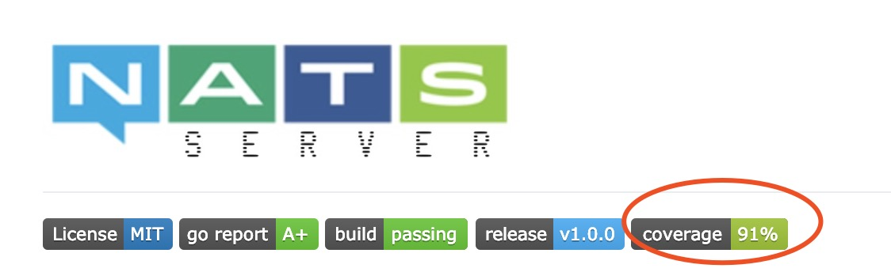

# NATS 开源学习——0X09：测试代码

> NATS源码学习系列文章基于[gnatsd1.0.0](https://github.com/nats-io/gnatsd/tree/v1.0.0)。该版本于2017年7月13
> 日发布（[Release v1.0.0](https://github.com/nats-io/gnatsd/releases/tag/v1.0.0)）,在此之前v0.9.6是2016年12月
> 16日发布的,中间隔了半年。算是一个比较完备的版本，但是这个版本还没有增加集群支持。为什么选择这个版本呢？
> 因为一来这个版本比较稳定，同时也包含了集群管理和[Stream](https://github.com/nats-io/nats-streaming-server)
> 落地相关的逻辑，相对完善。

在gnatsd的[github](https://github.com/nats-io/gnatsd/tree/v1.0.0) 上，
[coveralls](https://coveralls.io/github/nats-io/gnatsd)的代码覆盖率有91%

他是如何做到的呢？好的产品离不开充分的测试，gnats写了大量的单元测试和功能测试代码。

## 单元测试

在gnatsd的代码中，有两块测试代码，一部分是在server目录下的,主要文件有：

	├── auth_test.go
	├── client_test.go
	├── log_test.go
	├── monitor_test.go
	├── opts_test.go
	├── parser_test.go
	├── ping_test.go
	├── reload_test.go
	├── routes_test.go
	├── server_test.go
	├── service_test.go
	├── signal_test.go
	├── split_test.go
	├── sublist_test.go
	└── util_test.go

其中，一部分是逻辑功能性测试，比如在 ping_test.go里面，仅仅是调用了[go-nats](github.com/nats-io/go-nats)的Connect

	 23 func TestPing(t *testing.T) {
	 24     s := RunServer(&DefaultPingOptions)
	 25     defer s.Shutdown()
	 26
	 27     nc, err := nats.Connect(fmt.Sprintf("nats://localhost:%d", PING_CLIENT_PORT))
	 28     if err != nil {
	 29         t.Fatalf("Error creating client: %v\n", err)
	 30     }
	 31     defer nc.Close()
	 32     time.Sleep(10 * time.Millisecond)
	 33 }	

但是这里其实会运行到服务器CONNCECT/PING协议的处理逻辑。

另一部分是针对某个功能单元测试，比如对sublist的测试：

	 82 func TestSublistInsertCount(t *testing.T) {
	 83     s := NewSublist()
	 84     s.Insert(newSub("foo"))
	 85     s.Insert(newSub("bar"))
	 86     s.Insert(newSub("foo.bar"))
	 87     verifyCount(s, 3, t)
	 88 }

在插入三个主题时，判断节点数目是否正确。

所以在看gnatsd的代码时，如果看不懂的地方，可以结合这些测试用来来一起阅读。另外也可以结合[Debug Golang With Delve](http://www.czkit.com/posts/golang/debug/delve_try/) 进行调试，来看代码的执行步骤。

## 功能测试
在和server同级的目录下，还有个test的目录，主要文件有：

	gnatsd-1.0.0 cz$ tree -L 1 test
	├── auth_test.go
	├── bench_results.txt
	├── bench_test.go
	├── client_auth_test.go
	├── client_cluster_test.go
	├── cluster_test.go
	├── cluster_tls_test.go
	├── configs
	├── gosrv_test.go
	├── maxpayload_test.go
	├── monitor_test.go
	├── opts_test.go
	├── pedantic_test.go
	├── pid_test.go
	├── ping_test.go
	├── port_test.go
	├── proto_test.go
	├── route_discovery_test.go
	├── routes_test.go
	├── test.go
	├── test_test.go
	├── tls_test.go
	├── user_authorization_test.go
	└── verbose_test.go

在这个目录下执行：

	test cz$ go test  test.go ping_test.go -v
	=== RUN   TestPingSentToTLSConnection
	--- PASS: TestPingSentToTLSConnection (0.25s)
	=== RUN   TestPingInterval
	--- PASS: TestPingInterval (0.24s)
	=== RUN   TestUnpromptedPong
	--- PASS: TestUnpromptedPong (0.18s)
	PASS
	ok  	command-line-arguments	0.697s	 

可以看到ping的相关逻辑都有被测试到，比如 "TestPingInterval"测试了Ping的间隔，”TestUnpromptedPong“ 测试了没有收到Pong时候的表现。

借助这里的测试可以排查在日常使用gnatsd过程常见的一些问题。

## 总结
测试驱动开发曾经是很热门的开发模式，要去学习一个项目的代码，测试代码其实很好的切入点。gnatsd提供了覆盖超过91%的测试代码，所以学习过程中，借助
这些测试代码来看其源码会事半功倍。

	 
	 

